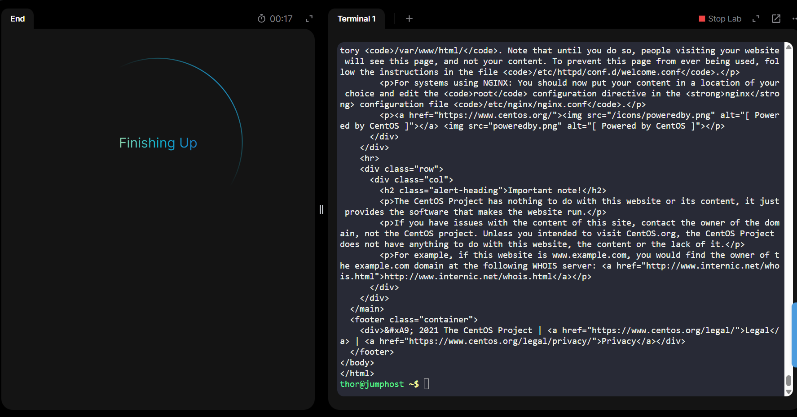

### Day 12: Linux Network Services

The Nautilus application development team recently finished the beta version of one of their Java-based applications, which they are planning to deploy on one of the app servers in Stratos DC. After an internal team meeting, they have decided to use the tomcat application server. Based on the requirements mentioned below complete the task:

a. Install tomcat server on App Server 3.

b. Configure it to run on port 8083.

c. There is a ROOT.war file on Jump host at location /tmp.

Deploy it on this tomcat server and make sure the webpage works directly on base URL i.e curl http://stapp03:8083

1️⃣ Login to App Server 3

From Jump Host:

ssh tony@stapp03

(Use correct default user if different.)

2️⃣ Install Tomcat on App Server 3

On CentOS / RHEL-based systems:

sudo yum install -y tomcat

Verify:

tomcat version

(or later via service status)

3️⃣ Configure Tomcat to run on port 8083
Edit server.xml
sudo vi /etc/tomcat/server.xml

Find this line (default 8080):
<Connector port="8080" protocol="org.apache.coyote.http11.Http11NioProtocol"

Change 8080 → 8083
<Connector port="8083" protocol="org.apache.coyote.http11.Http11NioProtocol"

Save and exit:

ESC :wq

4️⃣ Copy ROOT.war from Jump Host to App Server 3

On Jump Host:

scp /tmp/ROOT.war tony@stapp03:/tmp/

5️⃣ Deploy ROOT.war to Tomcat

On App Server 3:

sudo mv /tmp/ROOT.war /var/lib/tomcat/webapps/

⚠️ Important:

The file must be named exactly ROOT.war

Deploying as ROOT ensures it loads at base URL /

6️⃣ Set correct permissions
sudo chown tomcat:tomcat /var/lib/tomcat/webapps/ROOT.war

7️⃣ Start and enable Tomcat
sudo systemctl start tomcat
sudo systemctl enable tomcat

Check status:

systemctl status tomcat

You should see:

Active: active (running)

8️⃣ Verify Tomcat is listening on port 8083
ss -lntp | grep 8083

9️⃣ Test the application (VERY IMPORTANT)

From App Server 3:

curl http://localhost:8083

From Jump Host:

curl http://stapp03:8083

✅ If HTML output appears → deployment successful