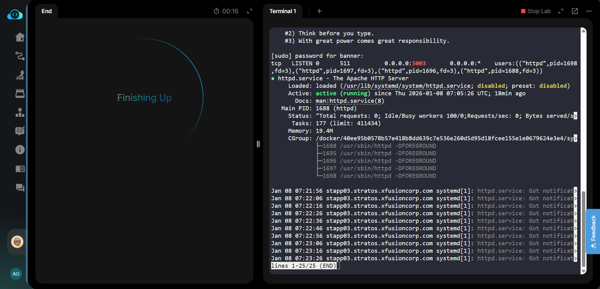

### Day 14: Linux Process Troubleshooting

We have one of our websites up and running on our Nautilus infrastructure in Stratos DC. Our security team has raised a concern that right now Apache’s port i.e 6300 is open for all since there is no firewall installed on these hosts. So we have decided to add some security layer for these hosts and after discussions and recommendations we have come up with the following requirements:

1. Install iptables and all its dependencies on each app host.

2. Block incoming port 6300 on all apps for everyone except for LBR host.

3. Make sure the rules remain, even after system reboot.

✅ STEP 1: Find Which Process Is Using Port 5003

Run on stapp01:

sudo netstat -tulnp | grep 5003

or

sudo ss -tulnp | grep 5003

You’ll see something like:

tcp LISTEN 0 0 0.0.0.0:5003  ...  PID/PROCESS

✅ STEP 2: Stop That Conflicting Service

If it shows another httpd (rare):

sudo pkill httpd

If it shows some other service (example: nginx, node, etc.):

sudo systemctl stop <service-name>

or kill directly (only if needed):

sudo kill -9 <PID>

✅ STEP 3: Confirm Port Is Free
sudo netstat -tulnp | grep 5003

👉 There should be NO OUTPUT.

✅ STEP 4: Start Apache
sudo systemctl start httpd
sudo systemctl status httpd

Must show:

Active: active (running)

Check port:

sudo netstat -tulnp | grep httpd

Should show:

0.0.0.0:5003 LISTEN httpd

✅ STEP 5: Repeat Check on Other App Servers

Do quickly on:

stapp02
sudo systemctl status httpd
sudo netstat -tulnp | grep 5003

stapp03
sudo systemctl status httpd
sudo netstat -tulnp | grep 5003

If any not running → start & fix same way.