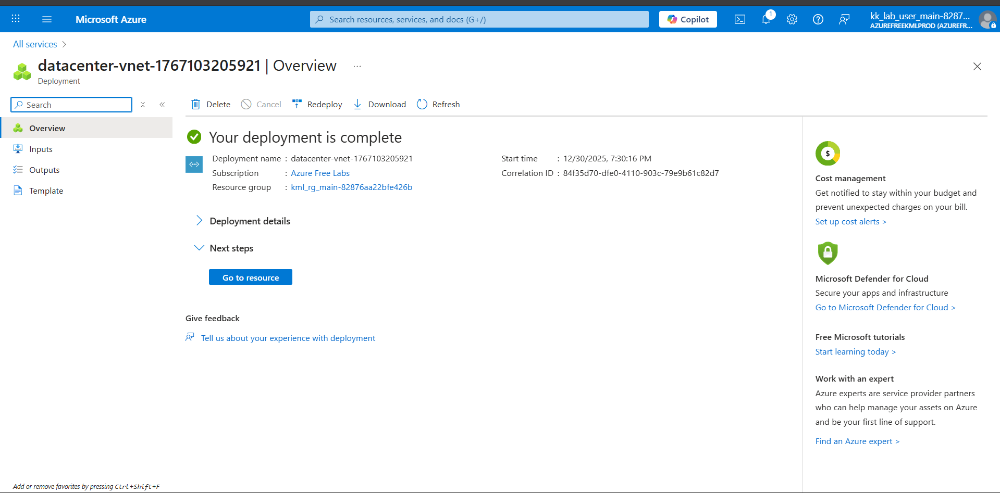

## AZURE

### Day 5: Create a Virtual Network (IPv4) in Azure

The Nautilus DevOps team is strategically planning the migration of a portion of their infrastructure to the Azure cloud. Acknowledging the magnitude of this endeavor, they have chosen to tackle the migration incrementally rather than as a single, massive transition. Their approach involves creating Virtual Networks (VNets) as the initial step, as they will be provisioning various services under different VNets.

Create a Virtual Network (VNet) named datacenter-vnet in the East US region with 192.168.0.0/24 IPv4 CIDR.

Use below given Azure Credentials: (You can run the showcreds command on the azure-client host to retrieve credentials)

Portal URL	https://portal.azure.com
Username	kk_lab_user_main-82876aa22bfe426b@azurefreekmlprod.onmicrosoft.com
Password	BgD6cN4^
Start Time	Tue Dec 30 13:54:57 UTC 2025
End Time	Tue Dec 30 14:54:57 UTC 2025

done
