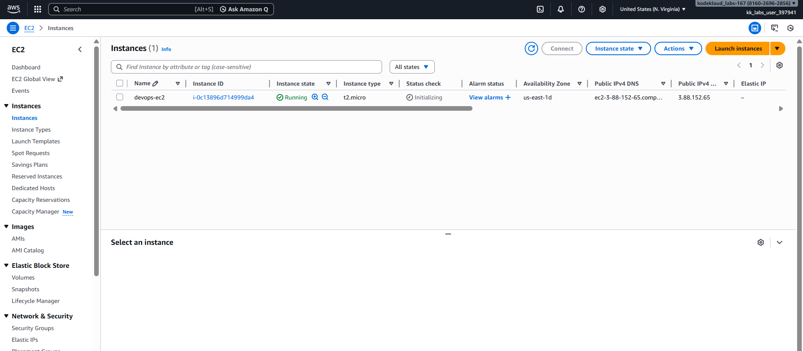

## AWS

### Day 6: Launch EC2 Instance

The Nautilus DevOps team is strategizing the migration of a portion of their infrastructure to the AWS cloud. Recognizing the scale of this undertaking, they have opted to approach the migration in incremental steps rather than as a single massive transition. To achieve this, they have segmented large tasks into smaller, more manageable units.

For this task, create an EC2 instance with following requirements:

1) The name of the instance must be devops-ec2.

2) You can use the Amazon Linux AMI to launch this instance.

3) The Instance type must be t2.micro.

4) Create a new RSA key pair named devops-kp.

5) Attach the default (available by default) security group.

Use below given AWS Credentials: (You can run the showcreds command on aws-client host to retrieve these credentials)

Console URL	https://816026962856.signin.aws.amazon.com/console?region=us-east-1
Username	kk_labs_user_397941
Password	Atwv9UkrRicD
Start Time	Wed Dec 31 14:46:48 UTC 2025
End Time	Wed Dec 31 15:46:48 UTC 2025

