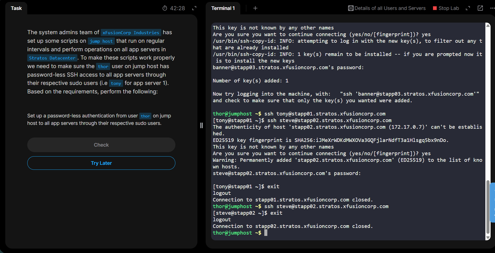

### Day 7: Linux SSH Authentication

The system admins team of xFusionCorp Industries has set up some scripts on jump host that run on regular intervals and perform operations on all app servers in Stratos Datacenter. To make these scripts work properly we need to make sure the thor user on jump host has password-less SSH access to all app servers through their respective sudo users (i.e tony for app server 1). Based on the requirements, perform the following:

Set up a password-less authentication from user thor on jump host to all app servers through their respective sudo users.

✅ Step-by-Step Execution
📍 Step 1: Login to Jump Host as thor
ssh thor@jump_host.stratos.xfusioncorp.com

(Password: mjolnir123)

🔑 Step 2: Generate SSH Key for thor

On jump host:

ssh-keygen -t rsa -b 4096

Press Enter for all prompts

Do NOT set a passphrase

This creates:

Private key → ~/.ssh/id_rsa

Public key → ~/.ssh/id_rsa.pub

🔁 Step 3: Copy SSH Key to Each App Server
▶️ App Server 1 (tony)
ssh-copy-id tony@stapp01.stratos.xfusioncorp.com

Enter password: Ir0nM@n

▶️ App Server 2 (steve)
ssh-copy-id steve@stapp02.stratos.xfusioncorp.com

Enter password: Am3ric@

▶️ App Server 3 (banner)
ssh-copy-id banner@stapp03.stratos.xfusioncorp.com

Enter password: BigGr33n

🧪 Step 4: Verify Password-less Access (VERY IMPORTANT)

From jump host, test each:

ssh tony@stapp01.stratos.xfusioncorp.com

ssh steve@stapp02.stratos.xfusioncorp.com

ssh banner@stapp03.stratos.xfusioncorp.com

✅ You should NOT be asked for a password

Exit each server:

exit
