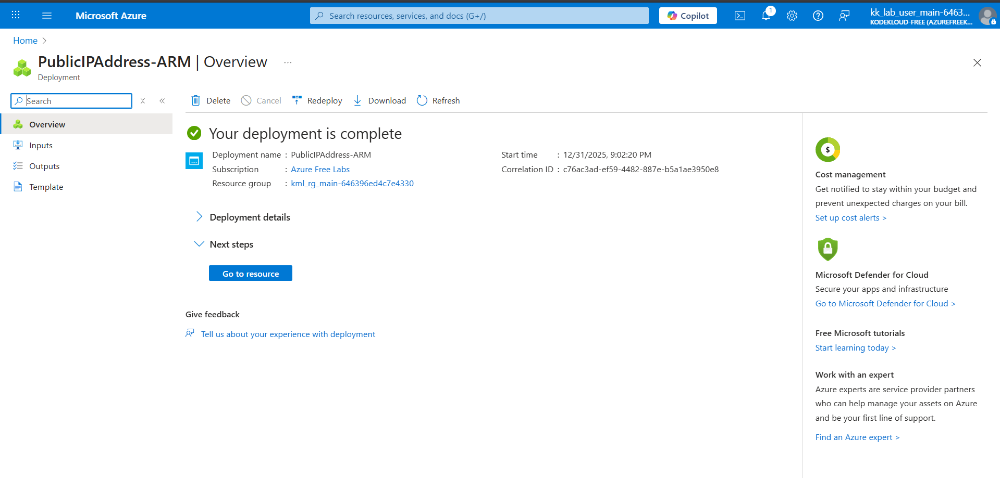

## AZURE

### Day 7: Create a Public IP Address for Azure VM

The Nautilus DevOps team is strategizing the migration of a portion of their infrastructure to the Azure cloud. Recognizing the scale of this undertaking, they have opted to approach the migration in incremental steps rather than as a single massive transition. To achieve this, they have segmented large tasks into smaller, more manageable units. This granular approach enables the team to execute the migration in gradual phases, ensuring smoother implementation and minimizing disruption to ongoing operations. By breaking down the migration into smaller tasks, the Nautilus DevOps team can systematically progress through each stage, allowing for better control, risk mitigation, and optimization of resources throughout the migration process.

For this task, allocate a Public IP address, name it as nautilus-pip.

Use below given Azure Credentials: (You can run the showcreds command on the azure-client host to retrieve credentials)

Portal URL	https://portal.azure.com
Username	kk_lab_user_main-646396ed4c7e4330@azurefreekmlprod3.onmicrosoft.com
Password	n6hpu==h
Start Time	Wed Dec 31 15:18:45 UTC 2025
End Time	Wed Dec 31 16:18:45 UTC 2025

