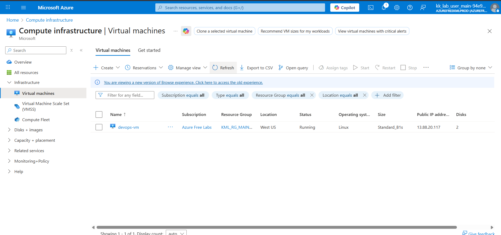

## AZURE

### Day 8: Attach Managed Disk to Azure Virtual Machine

The Nautilus DevOps team is migrating services to Azure. They are breaking down tasks to ensure better control and optimization. You are tasked with attaching an existing data disk to a virtual machine (VM).

An existing VM named devops-vm and a managed disk named devops-disk already exist in the East US region.

Attach the disk devops-disk to the VM devops-vm as a data disk.
Ensure the disk is attached to the VM devops-vm.
Make sure that the virtual machine initialization has been completed before submitting this task.

Use below given Azure Credentials: (You can run the showcreds command on the azure-client host to retrieve credentials)

Portal URL	https://portal.azure.com
Username	kk_lab_user_main-94e93915001b48a9@azurefreekmlprod.onmicrosoft.com
Password	v^c8kg$v
Start Time	Mon Jan 05 13:19:20 UTC 2026
End Time	Mon Jan 05 14:19:20 UTC 2026

