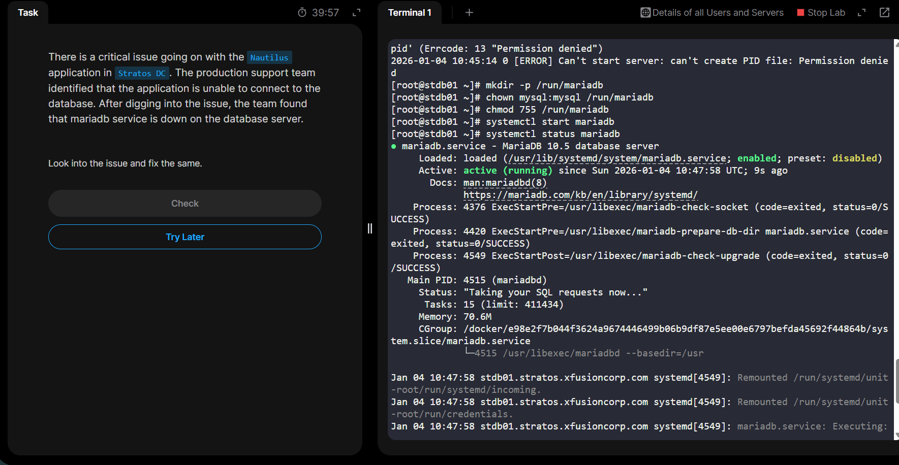

### Day 9: MariaDB Troubleshooting

There is a critical issue going on with the Nautilus application in Stratos DC. The production support team identified that the application is unable to connect to the database. After digging into the issue, the team found that mariadb service is down on the database server.

Look into the issue and fix the same.

ssh peter@stdb01
ls -l /var/log/mariadb/
cat /var/log/mariadb/mariadb.log

[root@stdb01 ~]# mkdir -p /run/mariadb
[root@stdb01 ~]# chown mysql:mysql /run/mariadb
[root@stdb01 ~]# chmod 755 /run/mariadb
[root@stdb01 ~]# systemctl start mariadb
[root@stdb01 ~]# systemctl status mariadb

