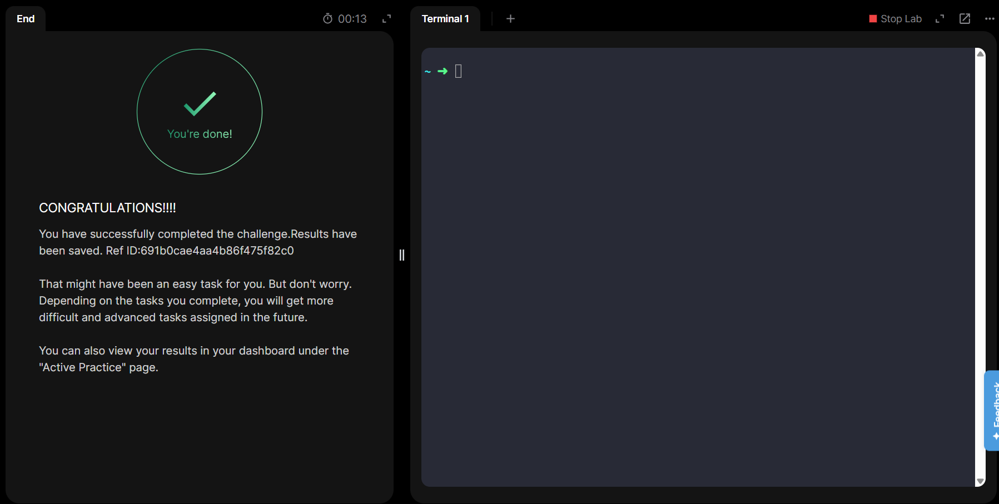

## AZURE

### Day 9: Attach Network Interface Card (NIC) to Azure Virtual Machine

The Nautilus DevOps team is migrating services to Azure. They are breaking down tasks to ensure better control and optimization. You are tasked with attaching an existing network interface (NIC) to a virtual machine (VM).

An existing VM named datacenter-vm and a network interface named datacenter-nic already exist in the West US region.

Attach the network interface datacenter-nic to the VM datacenter-vm.
Ensure the NIC's status is attached before submitting the task.
Make sure that the virtual machine initialization has been completed before submitting this task.

Use below given Azure Credentials: (You can run the showcreds command on the azure-client host to retrieve credentials)

Portal URL	https://portal.azure.com
Username	kk_lab_user_main-3c71b45e6edd4d87@azurefreekmlprod.onmicrosoft.com
Password	m=6@5ysm
Start Time	Mon Jan 05 13:31:30 UTC 2026
End Time	Mon Jan 05 14:31:30 UTC 2026

